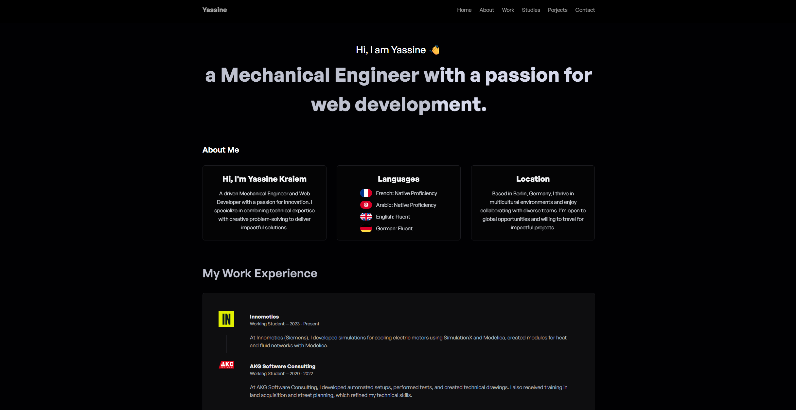

# Yassine Kraiem Portfolio

A modern, interactive 3D portfolio website showcasing engineering projects and professional experience with immersive Three.js animations.

## 📸 Preview

##  Features

-  Interactive 3D models and animations
-  Fully responsive design
-  Fast performance with Vite
-  Smooth animations with Framer Motion & GSAP
-  Contact form with EmailJS integration
-  Interactive maps with React Leaflet
-  GitHub Pages deployment ready

##  Key Sections

- **Hero** - Interactive 3D introduction
- **About** - Professional background
- **Experience** - Work history timeline
- **Studies** - Educational background
- **Projects** - Engineering project showcase
- **Contact** - Get in touch form

##  Live Demo

Visit: [https://yassinekraiem.vercel.app/](https://yassinekraiem.vercel.app/)

---

